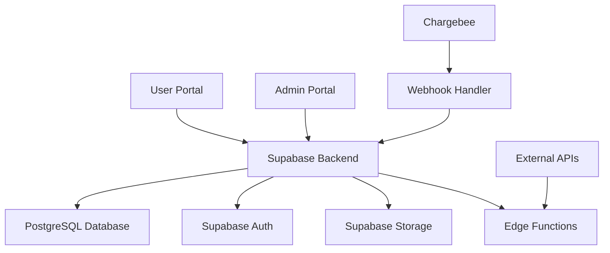

# HealthGuard Project Plan

## Project Structure (Monorepo)

```
wise-app/
├── apps/
│   ├── user-portal/          # User-facing React application
│   └── admin-portal/         # Admin React application
├── supabase/
│   ├── migrations/           # Database migrations
│   ├── functions/            # Edge Functions
│   └── config.toml           # Supabase configuration
├── packages/
│   └── shared/               # Shared utilities, types, components
├── docs/                     # Documentation
├── package.json              # Root package.json with workspaces
├── pnpm-workspace.yaml       # Workspace configuration
├── turbo.json                # Build orchestration (optional)
└── README.md
```

## System Architecture



## Key Components

- **User Portal**: React app for end-users (signup, onboarding, subscriptions)
- **Admin Portal**: React app for administrators (management, analytics)
- **Supabase Backend**: Database, auth, storage, edge functions
- **Chargebee Integration**: Payment processing and subscription management

## Todo List

1. [x] Analyze project requirements and technology stack
2. [x] Define project structure and folder organization
3. [ ] Set up Supabase project and configure database schema
4. [ ] Implement Row Level Security (RLS) policies and security measures
5. [ ] Create Supabase Edge Functions for business logic and webhooks
6. [ ] Initialize User Application with React 18, TypeScript, and Vite
7. [ ] Implement User Authentication flow (signup, login, biometric)
8. [ ] Develop multi-step onboarding flow with form validation
9. [ ] Integrate Chargebee for plan selection and payment processing
10. [ ] Build User Dashboard and profile management features
11. [ ] Initialize Admin Application with React 18, TypeScript, and Vite
12. [ ] Implement Admin authentication and role-based access control
13. [ ] Develop Admin Dashboard with metrics and charts
14. [ ] Create User Management module for admins
15. [ ] Build Plan Management module
16. [ ] Implement Subscription Management module
17. [ ] Set up testing framework (Jest, React Testing Library)
18. [ ] Configure CI/CD and deployment pipeline
19. [ ] Implement accessibility features and WCAG 2.1 AA compliance
20. [ ] Add error handling, loading states, and monitoring

# setting variables on supabase 
supabase secrets set CHARGEBEE_SITE=enyata-test
supabase secrets set CHARGEBEE_API_KEY=your_key_here